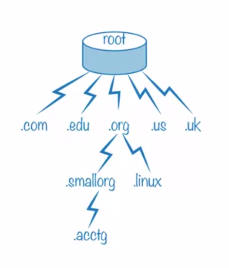

dns(domain name system -- система доменных имен) -- распределенная система для
получения информации о доменах. Чаще всего используется для получения IP-адреса
по имени хоста(комп. или устройства)

ключевые характеристики:
* распределенность -- ответственность за разные части 
иерархической структуры несут разные люди или организации; каждый узел сети
в обязательном порядке должен хранить только те данные, которые входят в его зону
отвественности
* Кэширование. Узел может хранить данные других узлов, чтобы уменьшить нагрузку на сеть
* Резервирование. За хранение и обслуживание своих узлов обычно отвечают несколько серверов

Структура днс
Корневая зона(корень) - .(точка) (ya.ru.) в самом конце, обычно не указывается

Схемы разрешения днс имен

1) Нерекурсивная.  
Клиент обращается к корневому днс серверу. Он отвечает, указывая адрес след. днс сервера.
Клинт обращается к след. серверу, который отсылает его к днс серверу нужного поддомена. и тд.
Пока не будет найден днс сервер, в котором хранится соответствие имени ip адресу.

2) Рекурсивная.  
Клиент запрашивает локальные днс сервер(мб роутер).  
Если сервер знает ответ(кэш), то он просто возращает ответ клиенту.  
Иначе он выполняет действия пункта (1) и возращает ответ клиенту.

\

А -- запись адрес хоста. host.org.ru IN A 192.168.0.1  
AAAA -- запись адрес хоста протокола IPv6. host.org.ru IN AААА 123:1:2:3:4:567:89cd  
CNAME -- запись, для создания псевдонимов.  
NS -- запись, в каждой зоне должно быть каким минимум 2 днс сервера. Эти записи служат
для их идентификации другими днс серверами, которые пытаются преобразовать имена хостов, 
относящихся к данной зоне.  
SOA -- запись, которая определяет информации о днс зоне. Primary name server. Hostmaster. Serial number.  
PRT -- запись, по ip адресу определить имя домена.  
MX -- запись, с их помощью удаленные серверы эл. почты узнают куда отправить почту вашей зоны.  
TXT -- запись, содержит текстовые данные. Иногда подвердить права на домен.

Указывает 