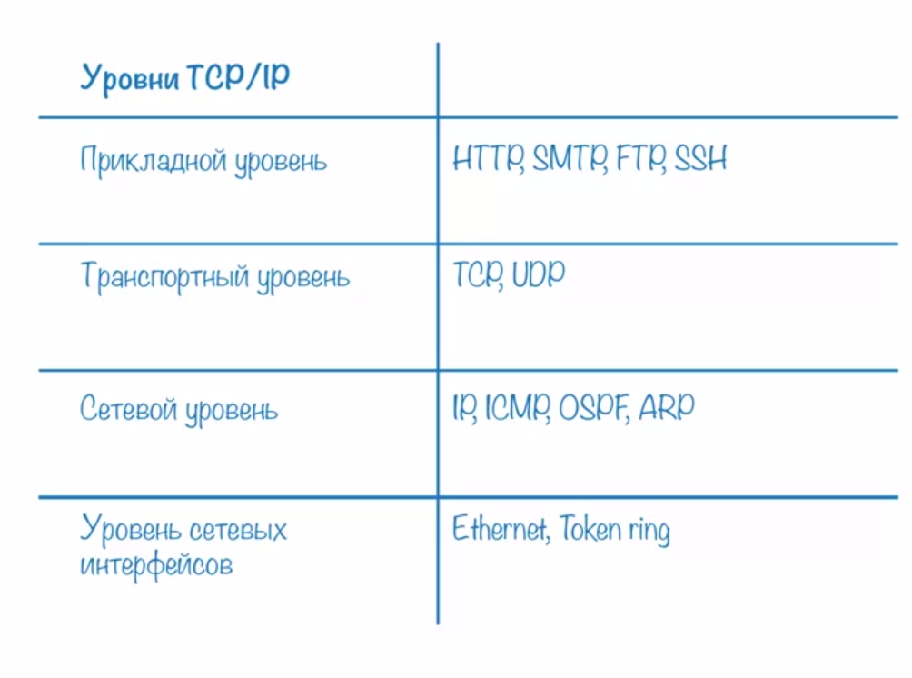
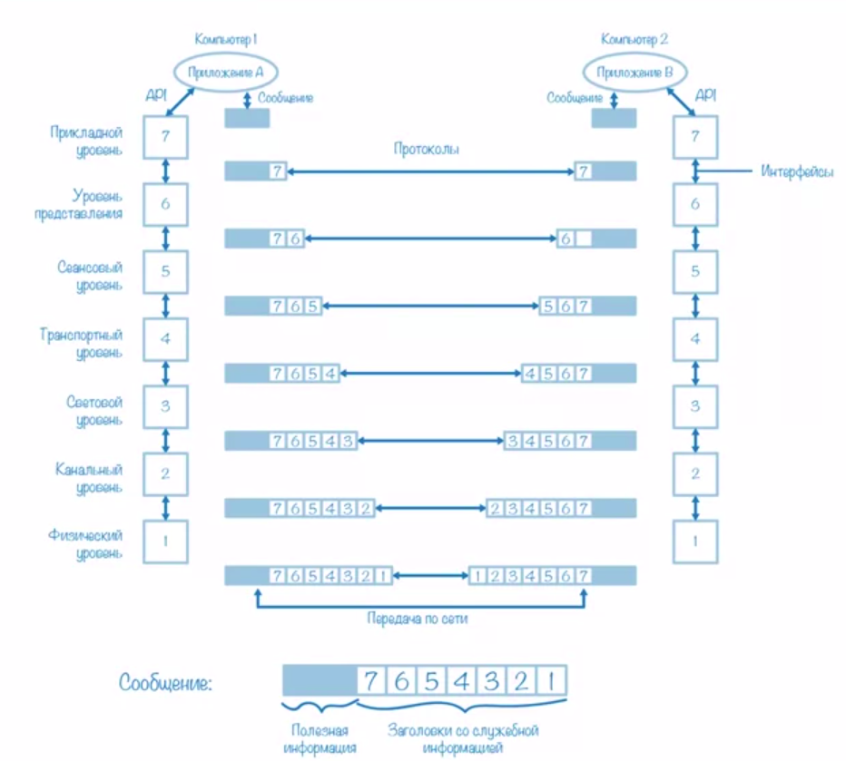

Tcp/Ip включает 4 уровня.

Уровень сетевых интерфесов -- Network access layer

Задачи: 
 1) Упаковка IP - пакета в единицу передаваемых данных промежуточной сети.
 2) преобразование сетевых адресов в адреса технологий данной промежуточной сети.
 
Сетевой уровень -- Network layer

1) Служит для образования единой транспортной системы, объединяющей несколько сетей, причем
эти сети могут использовать совершенно разные технологии
2) Пример протокола ip

Транспортный уровень -- Transport layer
1) Надежность. Уровень предоставляет приложениям или верх   ним уровням стека ту надежность, которая им требуется.
2) Tcp/Udp  
Необходимо передать большой файл, передаем кусочкам, требуется, чтобы весь файл пришел, да и ещё в правильном порядке.

Прикладной уровень -- Application layer
1) Набор различных протоколов с помощью которых пользователи сети получают доступ к разделяемым ресурсам.
2) HTTP/FTP

