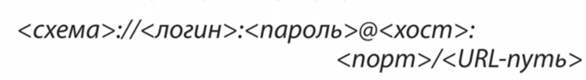
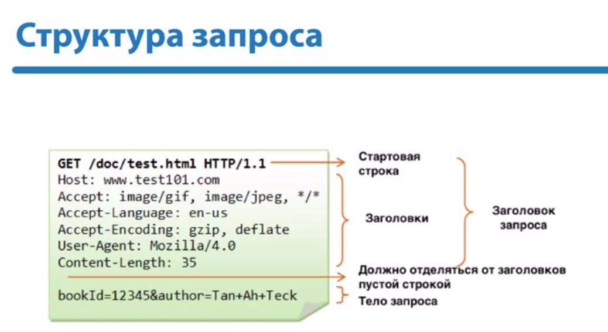
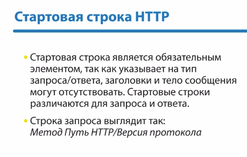
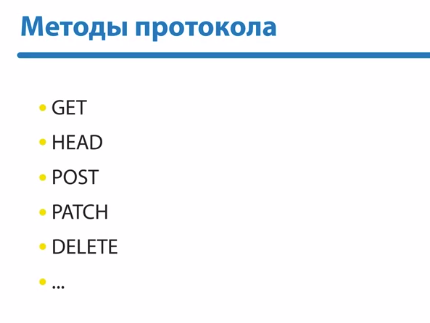
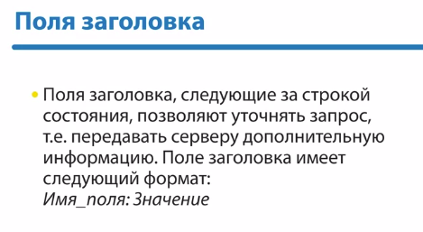
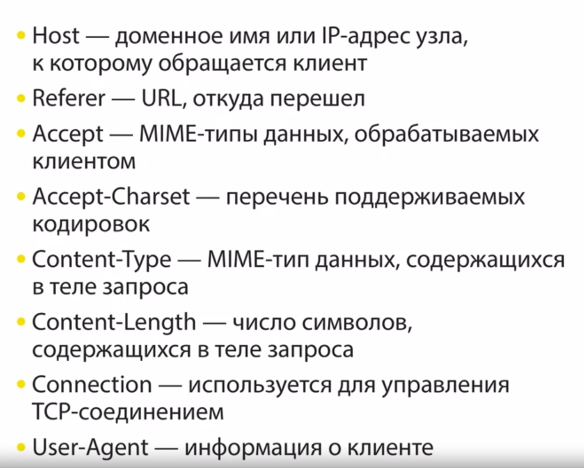
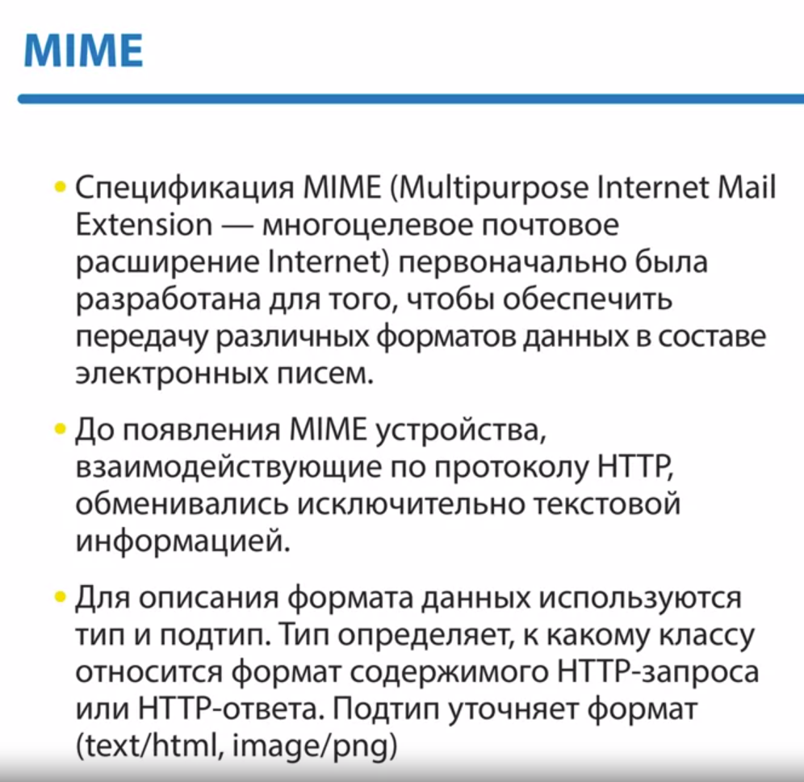
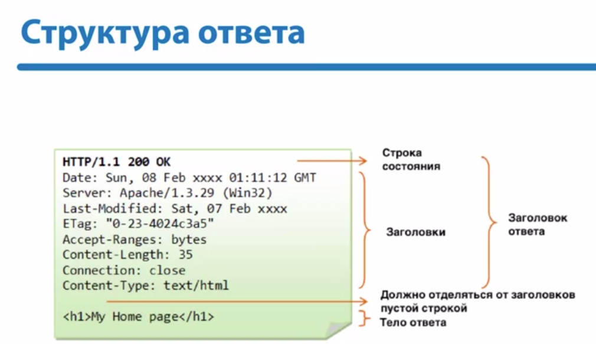
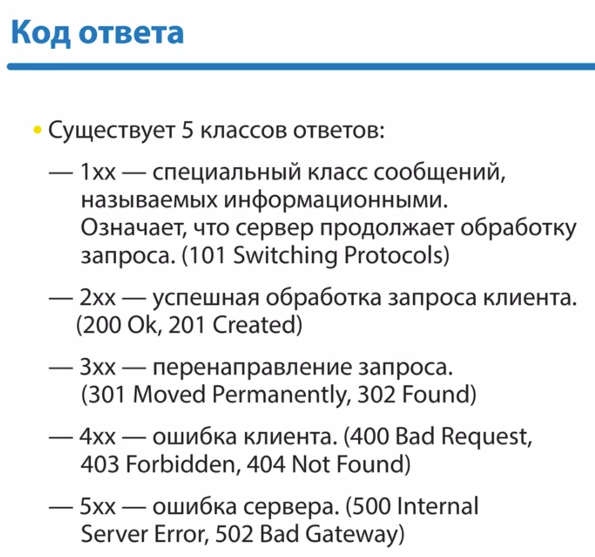
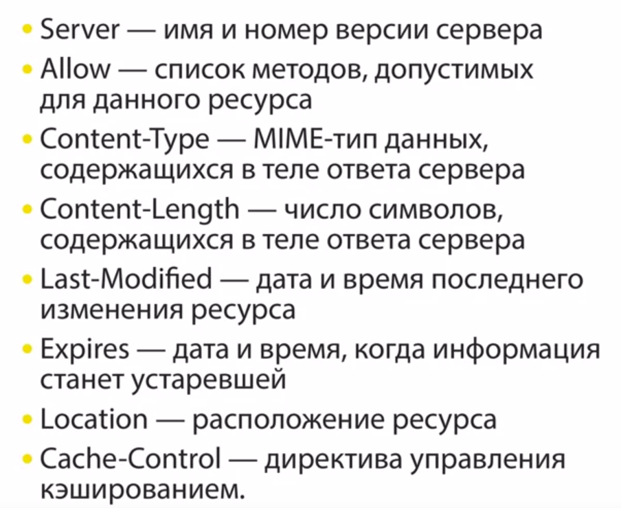

http -- протокол прикладного уровня для передачи гипертекста.

Все ПО с протоколом http разделяется на:  
* Сервер
* Клиент

HTTP работает повер протокола tcp

Cхема:
1) Установить tcp соединение.
2) Запрос клиента
3) Ответ сервера
4) Разрыв tcp соединения.  
Из этого следует, что протокол не хранит информацию о предыдущих запросах клиентов и ответах сервера

URI -- Uniform resource identifier -- короткая последовательность символов
, идентифицующий абстрактный ресурс.

URL -- Uniform resouce locator -- для однозначной идентификации ресурсов в сети Веб.  
Имеет следующую структуру:  
Схема -- http/ftp/etc  

  
  
  
  

  

  

