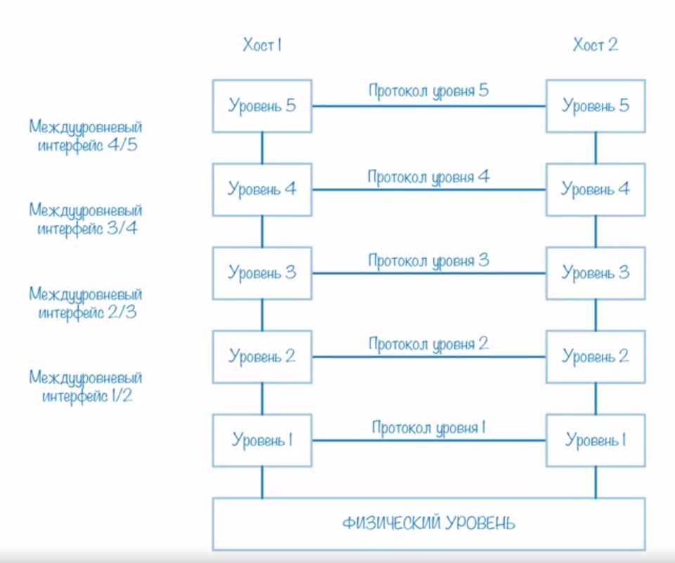
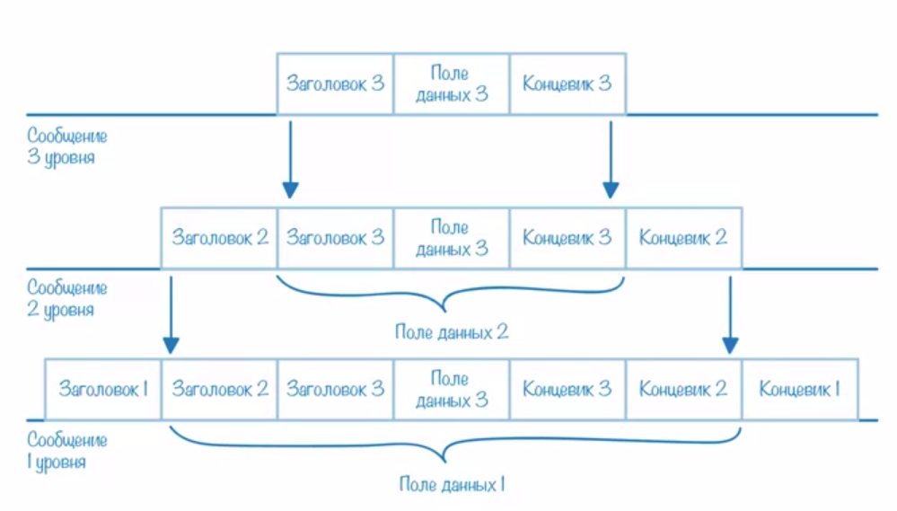

I) Основы организации комп сетей  
II) Опр. интерфейса и протокола  
III) Инкапсуляции протоколов

I) 
  1) Требования к большой сети  
    a) Работать с большим кол-вом разнобразного оборудования и ПО   
    б) Должна быть надежной и работать, если некоторые компоненты выйдут из строя
    в) Должна иметь возможность расти  
    г) Должна обеспечить качество обслуживать  
    д) Безопастность  

=> Декомпозировать задачу.  
Уровни Взаимодействия, каждый нижележащий уровень предоставляет интерфейс вышележащему.  
Каждый уровень решает свою задачу.

II)
  * Интерфейс -- это набор примитивных операций, которые нижний уровень предоставляет верхнему.
  * Протокол -- это правила и соглашения, используемые для связи уровня N одного компьютера с уровнем N другого компьютера.

Пользователь взаимодействует с интерфесом, протокол реализации взаимодействия.

III)
* Инкапсуляция -- включения сообщения вышестоящего уровня в сообщение нижестоящего уровня.

Формируем сообщение, передаем 3ему уровня, он его обрамляет и передает дальше и т.д..
Пока сообщения не передастся на другой хост, где оно в обратном варианте будет распарщено.  

Решение задачи построение большой сети -- декомпозиция на уровни.  
Сколько уровней, какие уровни, какие функции и как распределены по уровням -- архитектура сети.  

Общепринятые стандарты организации сетей:
1) Модель взаимодействия открытых сетей OSI.
2) Модель TCP/IP 
 
