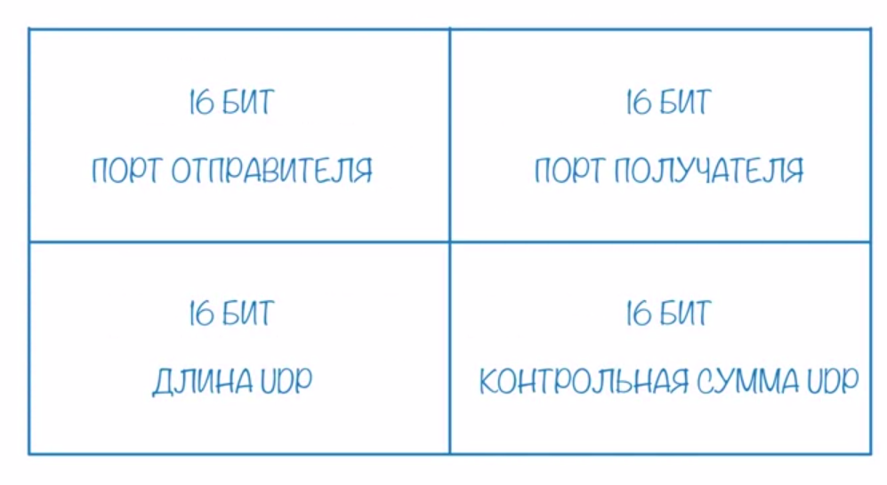
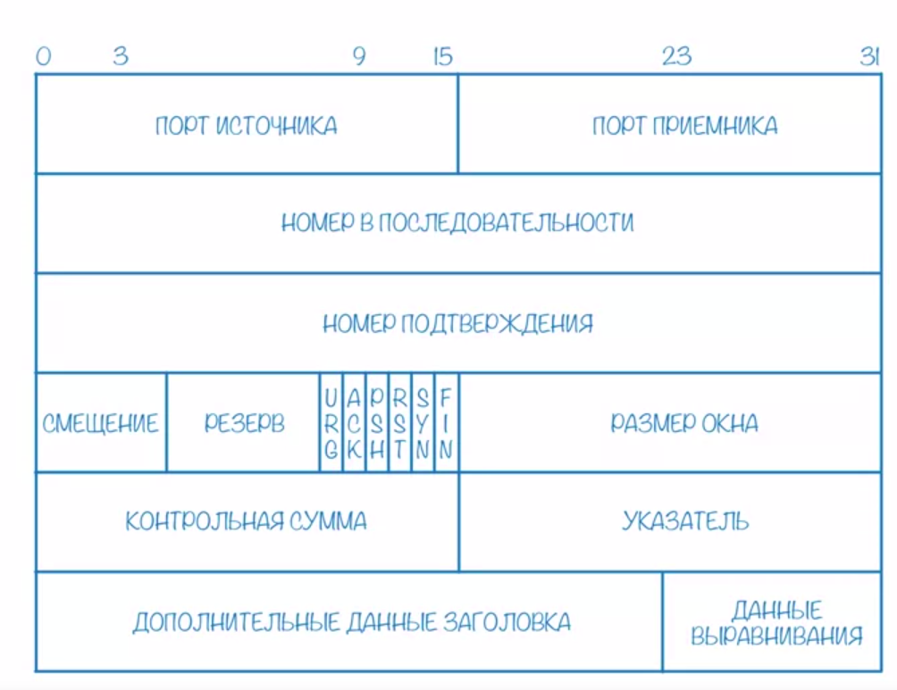

1) Передача данных м\у процессами в сети
2) Представления надежности

Для адресации на транс. уровне используются порты

192.168.0.1:8080

Udp -- user datagram protocol

Без установление логического соединения.  
Не гарантирует доставку данных.  
Нет гарантий сохрания исходного порядка дейтаграмм.  
НО, гарантирует корректность данных внутри одной дейтаграммы.

Использует, когда минимальная задержка при передачи данных очень важна. При этом возможна потеря данных.
Сервис видеостримминга.

TCP -- transmission control protocol

Является надежным.  
Работает с установление лог соед.  
Гарантирует доставку и порядок.

Лог соединенение -- договоренность о параметрах м\у процессами.

Tcp 3 этапа:
1) Установление лог. соединения
2) Обмен данными 
3) Закрытие соединения 